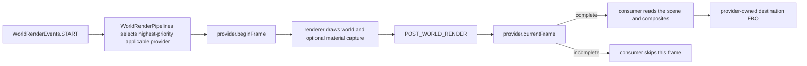
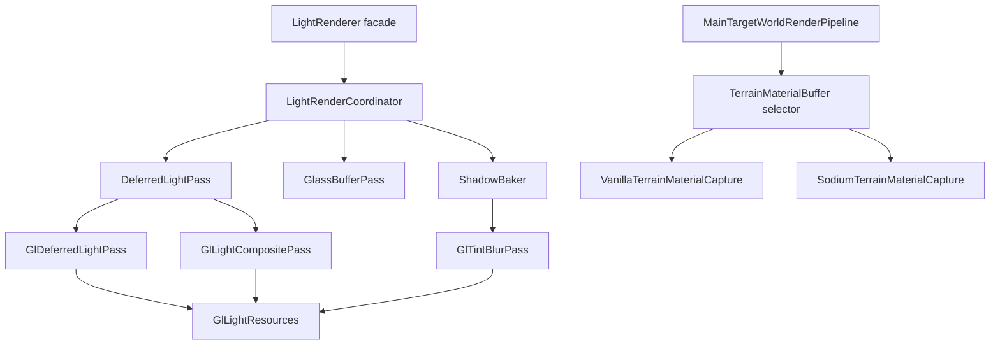

# World render pipelines

Any effect that reads back and re-composites the rendered world needs one *coherent* frame. A
color texture from one stage, depth from another, and matrices from a third can all be
individually valid while the combination is invalid. `glue-render` therefore exposes a
renderer-neutral frame contract and a priority-based proxy, so consumers never detect Vanilla,
Sodium, or Iris themselves. Lumos is one such consumer; it is not the only possible one, and the
contract does not name it.

Package: `fr.lacaleche.glue.client.render.pipeline`.

## Frame schema

```text
WorldRenderPipeline
  id
  isApplicable()
  beginFrame(sequence, materialRequested)
  currentFrame(sequence) -> Optional<WorldRenderFrame>
  isAuxiliaryPass()

WorldRenderFrame
  sequence
  sourceFramebufferId          scene snapshot source
  destinationFramebufferId     final composite destination
  sceneColorTextureId
  sceneDepthTextureId
  width, height
  viewMatrix, projectionMatrix
  cameraPosition
  colorEncoding                SRGB | LINEAR
  compositeStage               FINAL_COLOR | PRE_TONEMAP
  material                     Optional<MaterialFrame>

MaterialFrame
  frameSequence                must equal WorldRenderFrame.sequence
  providerId
  colorTextureId               linear albedo RGB + packed normal A
  depthTextureId               matching visible-surface depth
  width, height                must equal the scene dimensions
```

The `WorldRenderFrame` constructor rejects missing GL objects, mismatched dimensions, and
material data from another frame. It copies matrices and camera position when the frame is
created. A provider must return `Optional.empty()` rather than assemble a partially coherent
frame. Lumos currently consumes only `SRGB` + `FINAL_COLOR`; it rejects other declared stages
until their composite math is implemented.



`glue-render` drives the registry itself: its `WorldRenderEvents.START` listener calls
`WorldRenderPipelines.beginFrame()`. Selection happens once at frame start and remains fixed
until the next frame, so a shaderpack toggle or a nested renderer pass cannot change half of the
inputs mid-effect.

## Requesting material

Material capture costs a terrain replay (Vanilla) or an extra attachment (Sodium), so it only
runs when a consumer needs it. A consumer declares that need once, at client init:

```java
WorldRenderPipelines.requestMaterial(() -> !LightManager.getInstance().isEmpty());
```

`beginFrame()` evaluates every registered supplier; if any returns true, the selected provider is
started with `materialRequested = true`. A provider that cannot produce material for the current
configuration (Iris shaderpack active, or Fabulous graphics) ignores the flag and cancels the
material frame.

## Runtime matrix

“Iris installed” and “Iris shaderpack active” are different states. Iris installed with shaders
disabled follows the normal main-target pipeline.

| Vanilla renderer | Sodium | Iris installed | Iris pack active | selected world pipeline | material provider | Lumos status |
|---|---|---|---|---|---|---|
| yes | no | no | no | `glue:main_target` | `glue:vanilla_terrain_replay` | enabled |
| yes | no | yes | no | `glue:main_target` | `glue:vanilla_terrain_replay` | enabled |
| no | yes | no | no | `glue:main_target` | `glue:sodium_0_7_3_mrt` | enabled |
| no | yes | yes | no | `glue:main_target` | `glue:sodium_0_7_3_mrt` | enabled |
| no | yes | yes | yes | `glue:iris_final_color` | none | enabled, no material (see caveats) |

Iris hard-depends on Sodium, so “Iris pack active without Sodium” is not a reachable runtime
state and has no row.

Fabulous graphics (with no Iris shaderpack) also selects `glue:main_target`, but the material
frame is suppressed: the transparency post-chain composites translucents from a separate target,
so a captured material depth would not match the main scene depth. Lumos still runs, falling back
to the scene-color estimate for albedo, and glass is not lit — the degradation the renderer
accepted before the pipeline abstraction existed. An active Iris shaderpack takes priority over
Fabulous.

There is no Iris material capture. An active pack owns an arbitrary colortex layout, so
`glue:iris_final_color` publishes no `MaterialFrame`; consumers fall back to estimating
reflectance from the already-lit scene color.

## Built-in providers

| id | priority | applicable when | frame |
|---|---|---|---|
| `glue:main_target` | `0` | no Iris shaderpack is active | main color/depth target, captured level matrices, camera position, optional Vanilla/Sodium material |
| `glue:iris_final_color` | `100` | an Iris shaderpack is active | same targets and matrices as `glue:main_target`, no material |

`glue:main_target` chooses its material capture through `TerrainMaterialBuffer`: Sodium MRT when
Sodium is loaded, Vanilla terrain replay otherwise. Under Fabulous graphics it publishes the same
frame but suppresses material capture (main depth and the separately-composited translucent color
do not describe one surface), so consumers fall back to the scene-color estimate.

`glue:iris_final_color` publishes Minecraft's main render target and the captured level matrices
while a pack is active. It is the empirically-working approximation, not a proven-coherent frame:
the pack may already have tonemapped or bloomed the color it hands out, and the pack's own scene
depth may differ from Minecraft's main depth. Effects still render correctly enough to be useful
in practice, which is why the provider publishes rather than fails closed. Both `SRGB` and
`FINAL_COLOR` are declared by convention here, not by proof.

A pack-aware Iris integration can register above priority `100`, be applicable only to the pack or
Iris version it understands, and publish a frame it can actually prove coherent.

## Registering an implementation

The API contains no Vanilla, Sodium, or Iris types. A renderer adapter keeps those dependencies
inside its implementation:

```java
public final class MyWorldPipeline implements WorldRenderPipeline {
    @Override
    public String id() {
        return "mymod:world";
    }

    @Override
    public boolean isApplicable() {
        return myRendererOwnsThisFrame();
    }

    @Override
    public void beginFrame(long sequence, boolean materialRequested) {
        // Select and prepare this frame's renderer-owned targets.
    }

    @Override
    public Optional<WorldRenderFrame> currentFrame(long sequence) {
        // Return empty unless color, depth, matrices, destination, and optional
        // material all describe this sequence and the same render stage.
        return Optional.of(buildFrame(sequence));
    }
}

WorldRenderPipelines.register(new MyWorldPipeline(), 200);
```

The provider owns renderer detection, capture hooks, and target discovery. A consumer owns its
effect only. A material implementation is optional and is identified by
`MaterialFrame.providerId()`; it does not change which world pipeline a consumer calls.

## Implementation layout



`LightRenderer` contains only public configuration and lifecycle methods. The coordinator owns
frame admission, one light snapshot, visibility, and pass order. Each GPU operation has one pass
class; shader programs and fullscreen geometry are shared through `GlLightResources`.

`TerrainMaterialBuffer` owns only frame selection. Vanilla replay owns its render pipelines and
target. Sodium MRT owns its target, attachment negotiation, draw-buffer restoration, and pass
reflection. Mixins call the thin `TerrainMaterialHooks` bridge and do not own capture state.

The implementation packages mirror those ownership boundaries:

```text
glue-lumos client.render.light
  public API and lifecycle
  internal.pipeline    frame orchestration, visibility, glass and deferred passes
  internal.gl          raw GL passes, shared programs, accumulation targets
  internal.shadow      shadow cache, map renderer, parameters and pipelines
  internal.scene       camera-space scene captures

glue-render client.render
  pipeline             public renderer-neutral frame API
  internal.world       built-in world-frame providers
  internal.material    material selector, targets, Vanilla and Sodium capture
  internal.gl          renderer-independent GL state snapshots

glue-render client.mixin
  material             Vanilla material hooks
  material.sodium      optional Sodium hooks
  shader.capture       capture/composite hooks
  shader.pipeline      RenderType accessors
  shader.post          post-chain accessors
```

## Known conflict points

| area | current risk | required resolution |
|---|---|---|
| Iris color/depth | `glue:iris_final_color` publishes Minecraft's main color and depth; a pack's own scene depth may differ | a pack-aware provider must select and validate one matching pair |
| Iris matrices | shaderpacks may jitter, displace, or replace the captured Vanilla projection | provider must publish the exact matrices for its depth |
| Iris destination | the post-world hook binds Minecraft's main FBO before listeners; a pack may overwrite it later | a pack-aware provider/composite hook must own destination and restoration |
| Composite stage | final-color injection happens after shaderpack exposure, bloom, TAA, and tonemapping | provider must declare and implement `FINAL_COLOR` or `PRE_TONEMAP` semantics |
| Iris material | no generic material path exists for a pack-defined G-buffer | add capture only with exact depth/coverage proof |
| Sodium MRT | attachment 1 or draw buffers may already belong to another renderer | reject the frame or negotiate an unused attachment |
| Sodium shader patch | exact source anchors are tied to Sodium `0.7.3` | keep version guard and disable adapter on mismatch |
| GL state | raw passes can modify MRT draw-buffer vectors | `SavedGlState` and Sodium capture restore every active draw buffer |
| Shadow/glass passes | assigning private Glue shaders to Iris `TERRAIN` can alter their semantics | run through an explicit provider bypass or dedicated adapter contract |
| Global matrices | captures can be overwritten by another render | `glue:main_target` rejects a changed matrix capture token |
| Optional mixins | Sodium hooks live in the general mixin config | `GlueRenderMixinPlugin` rejects them when Sodium is absent |

## Iris provider acceptance checklist

`glue:iris_final_color` answers none of these with proof — it is accepted because it works in
practice. A pack-aware Iris provider registered above priority `100` is *proven* only when all
answers are yes:

1. Is the color source the exact image that the destination currently contains?
2. Was the depth texture generated for that color stage and viewport?
3. Do the supplied view/projection matrices reconstruct that depth without drift or jitter?
4. Is the composite destination writable at the declared color encoding and stage?
5. Will Iris preserve, consume, or later overwrite the composite as intended?
6. If material is present, does its own depth or coverage prove pixel alignment?
7. Are framebuffer, draw-buffer, viewport, texture, and program states fully restored?
