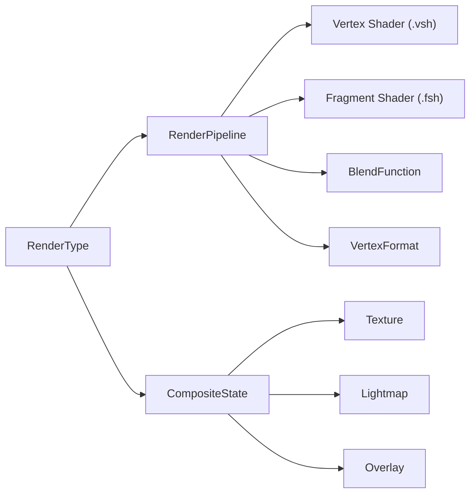
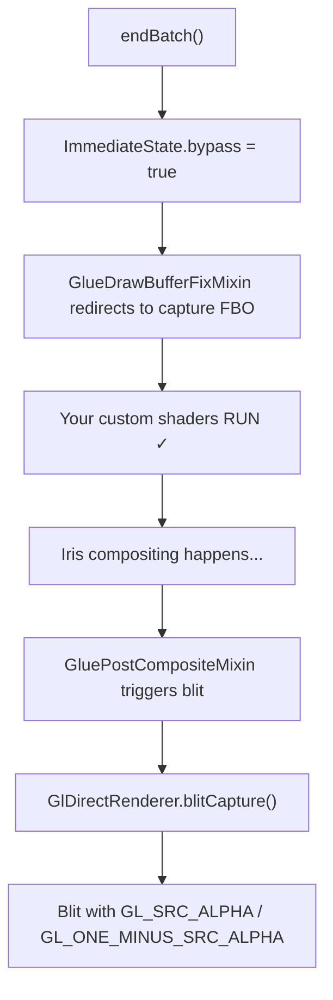

# How Iris Intercepts Rendering — Deep Dive

## The Core Problem

Iris is a **shader replacement engine**. When a shader pack is active, Iris **replaces every MC shader program** with its own shader programs from the pack. Your custom `.vsh`/`.fsh` files **never run under Iris** — they are fully overridden.

---

## 1. How MC 1.21.8 Rendering Works (Vanilla)



When you call `bufferSource.getBuffer(renderType)`, MC:
1. Looks up the `RenderPipeline` from the `RenderType`
2. Compiles the pipeline's vertex + fragment shaders into a `GlProgram`
3. On `endBatch()`, draws all queued vertices using that compiled program + blend/depth/cull state

**Your custom shaders run. Your blend mode applies. Everything works.**

---

## 2. What Happens When Iris Is Active

Iris injects a mixin `MixinShaderManager_Overrides` into `GlDevice.getOrCompilePipeline()`:

```java
// Iris mixin — intercepts EVERY pipeline compilation
@Inject(method = "getOrCompilePipeline", at = @At("HEAD"), cancellable = true)
private void redirectIrisProgram(RenderPipeline renderPipeline, CallbackInfoReturnable<GlRenderPipeline> cir) {
    // Skip if bypass is enabled
    if (ImmediateState.bypass) return;  // <-- KEY ESCAPE HATCH

    IrisRenderingPipeline irisPipeline = ...;
    
    // Look up what Iris shader this pipeline maps to
    ShaderKey shaderKey = IrisPipelines.getPipeline(irisPipeline, renderPipeline);
    
    if (shaderKey != null) {
        // REPLACE your shader with the shader pack's program
        GlProgram irisProgram = irisPipeline.getShaderMap().getShader(shaderKey);
        cir.setReturnValue(new GlRenderPipeline(renderPipeline, irisProgram));
        //                                      ^^^^^^^^^^^^^^
        //                     Keeps your pipeline's blend/depth/cull state
        //                     but REPLACES the shader program
    }
}
```

### What `assignIrisProgram("ENTITIES_TRANSLUCENT")` actually does:

It registers your `RenderPipeline` in Iris's lookup map:

```java
// IrisPipelines.java
coreShaderMap.put(yourPipeline, p -> ShaderKey.ENTITIES_TRANSLUCENT);
```

This tells Iris: *"When you see this pipeline, replace its shader with the shader pack's `gbuffers_entities` translucent variant."*

### What is preserved vs. replaced:

| Attribute | Preserved? | Notes |
|---|---|---|
| **Vertex/Fragment Shader** | ❌ **REPLACED** | Iris substitutes the shader pack's GLSL |
| **BlendFunction** | ✅ Preserved | Part of pipeline state, not the shader |
| **DepthWrite** | ✅ Preserved | Part of pipeline state |
| **Cull** | ✅ Preserved | Part of pipeline state |
| **VertexFormat** | ✅ Preserved | Part of pipeline state |
| **Texture/Lightmap/Overlay** | ✅ Preserved | Part of RenderType's CompositeState |

> [!IMPORTANT]
> **The blend mode IS preserved.** `BlendFunction.LIGHTNING` (additive) will work under Iris when rendering through MC's normal buffer source — Iris replaces the shader but keeps the pipeline state including blend.

---

## 3. Glue's Three Rendering Strategies

### Strategy A: Direct Pipeline (what Ignis does for particles)

```java
RenderType type = pipeline.entityType(texture);
VertexConsumer consumer = bufferSource.getBuffer(type);
// ... emit vertices ...
// No endBatch() — MC flushes the buffer source naturally
```

**With Iris:** Your `.vsh`/`.fsh` get replaced by the shader pack's `gbuffers_entities`. But **blend mode, depth, and cull are preserved**. The sprite renders with additive blending using the shader pack's entity shader.

**Pros:** Simple, blend mode works, Iris-compatible
**Cons:** Custom shader effects (hologram, frozen, etc.) are lost under Iris

---

### Strategy B: ShadedBufferSource Capture/Blit (what the existing entity pipelines use)

```java
ShadedBufferSource shadedSource = pipeline.wrap();
// ... render through shadedSource ...
shadedSource.endBatch();
```

**With Iris:**
1. `endBatch()` sets `ImmediateState.bypass = true` — **disabling Iris's shader override**
2. Renders into a **private capture FBO** with your actual custom shaders
3. After Iris compositing, `GluePostCompositeMixin` calls `postCompositeBlit()`
4. Blits the capture FBO onto the main framebuffer with **alpha blending** and depth testing



**Pros:** Custom shaders actually run under Iris, perfect for visual effects (hologram, frozen, etc.)
**Cons:** The blit uses **fixed alpha blending** — additive content is composited with the wrong blend mode

> [!WARNING]
> This is why additive doesn't work with Strategy B: `GlDirectRenderer.blitCapture()` hardcodes:
> ```java
> GL14.glBlendFuncSeparate(GL_SRC_ALPHA, GL_ONE_MINUS_SRC_ALPHA, GL_ONE, GL_ONE_MINUS_SRC_ALPHA);
> ```
> An additive sprite rendered to the capture FBO (correctly) gets blitted back with alpha blending (incorrectly).

---

### Strategy C: Raw GL Deferred (ShaderRenderer / GlDirectRenderer)

```java
DeferredDrawQueue.defer(() -> {
    // Raw GL calls with your own compiled shader programs
});
```

**With Iris:** Deferred to `WorldRenderEvents.LAST` (after all Iris passes). Uses entirely custom GL — Iris never touches it. **But** this bypasses MC's entire buffer source system.

---

## 4. Why the "Fallback" Iris Program Exists

It's **not a fallback** — it's a **routing instruction**. Without it:

```
Iris sees your custom pipeline → no mapping found → WARNING logged →
your pipeline compiles with vanilla GLSL → Iris doesn't know which 
render pass to put it in → renders at wrong time → visual artifacts
```

With the mapping:

```
Iris sees your custom pipeline → maps to ENTITIES_TRANSLUCENT →
renders during the entity pass → correct depth/lighting/compositing →
shader pack's entity shader runs → your blend mode is preserved
```

The Iris program name tells Iris **when** and **where** in its multi-pass pipeline to render your geometry. Without it, Iris doesn't know how to handle your geometry in its deferred rendering pipeline.

---

## 5. The Current Limitation

You essentially have two choices today:

| | Custom Shader Runs | Additive Blend Works | Iris Compatible |
|---|---|---|---|
| **Strategy A** (direct) | ❌ Replaced by shader pack | ✅ Yes | ✅ Yes |
| **Strategy B** (capture/blit) | ✅ Yes | ❌ Blit uses alpha | ✅ Yes (but wrong blend) |

**Neither gives you custom shaders + additive + Iris at the same time.**

---

## 6. Proposed Architecture: Blend-Aware Capture/Blit

To build a truly independent system, `ShadedBufferSource` / `GlDirectRenderer` needs to be **blend-mode aware**:

### Option 1: Per-Pipeline Blit Blend

Store the pipeline's `BlendFunction` on the `ShadedBufferSource`, and use it during blit:

```java
// In GlDirectRenderer.blitCapture() — instead of hardcoded alpha blend:
if (blendMode == BlendFunction.LIGHTNING) {
    // Additive blit: src accumulates onto scene
    GL14.glBlendFuncSeparate(GL_ONE, GL_ONE, GL_ONE, GL_ONE);
} else {
    // Default alpha blit
    GL14.glBlendFuncSeparate(GL_SRC_ALPHA, GL_ONE_MINUS_SRC_ALPHA, GL_ONE, GL_ONE_MINUS_SRC_ALPHA);
}
```

### Option 2: Multiple Capture FBOs

Separate capture FBOs per blend mode, each blitted with its correct blend function.

### Option 3: Raw GL Bypass (Most Powerful)

For the testmod sprite case specifically, use `DeferredDrawQueue` with raw GL that handles everything:
- Bind your own compiled shader  
- Set your own blend state (additive)
- Draw the textured quad manually
- Iris never intercepts because it's raw GL after all passes

This is the `GlDirectRenderer` approach but with texture support and per-draw blend control.

---

## Summary

The "Iris program" isn't a fallback — it's a **routing tag** that tells Iris which render pass your geometry belongs to. Without it, Iris doesn't know where to schedule your draw calls in its deferred pipeline.

For additive blending specifically, **Strategy A** (direct buffer source rendering) is the correct approach today because Iris preserves the pipeline's `BlendFunction`. Your custom `.vsh`/`.fsh` won't run (the shader pack replaces them), but for a simple fullbright additive sprite, that doesn't matter — the shader pack's entity shader produces equivalent output.

For a truly independent system where **custom shaders + custom blend + Iris** all work together, the `blitCapture()` function needs to be made blend-mode aware (Option 1 above). This would be a Glue core enhancement.
